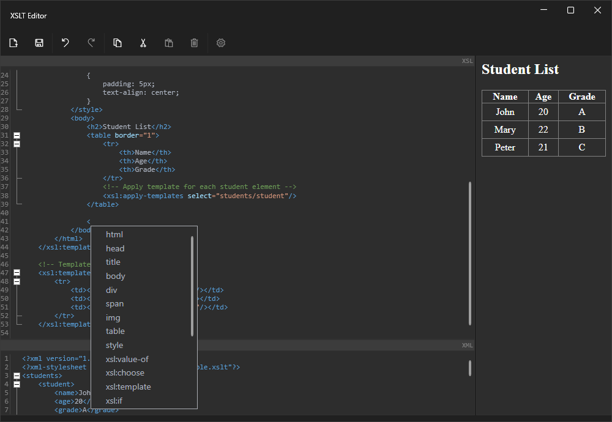

# Xslt-Editor
XSLT Editor is a tool for creating and editing XSLT stylesheets, enabling the conversion of XML to HTML and other formats with syntax support and validation.

## Features

- **Syntax Highlighting**: Enhanced readability and editing experience with syntax highlighting for XSLT and XML.
- **Validation**: Real-time validation to ensure your XSLT stylesheets are error-free.
- **Conversion**: Easily convert XML documents to HTML or other formats using your custom XSLT stylesheets.
- **User-Friendly Interface**: Intuitive and easy-to-use interface for both beginners and advanced users.

## Getting Started

To get started with Xslt-Editor, follow these simple steps:

1. **Download the Source Code**: Clone or download the repository to your local machine.
2. **Compile the Application**: Open the solution file in Visual Studio and build the project.
3. **Run the Application**: Once compiled, run the executable to start the XSLT Editor.

### Prerequisites

- **.NET 6**: Ensure you have .NET 6 installed on your machine. You can download it from the [official .NET website](https://dotnet.microsoft.com/download/dotnet/6.0).

## License
This project is licensed under the MIT License - see the [LICENSE.md](LICENSE) file for details.
