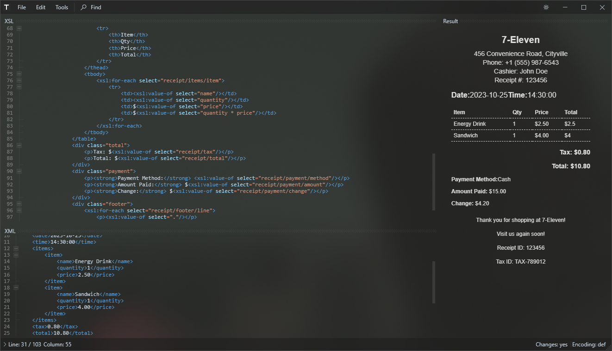
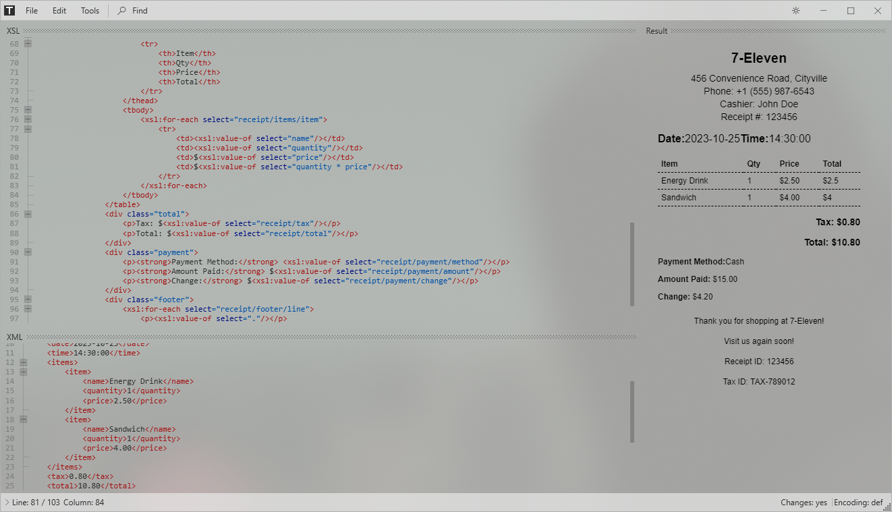

# XSLT Editor

A lightweight XSLT editor with real-time compilation and Fluent Design interface.

## Features
- **XSLT 1.0 Support**  
  Instant error checking using `XslCompiledTransform` with live diagnostics.
- **Smart Autocompletion**  
  Context-aware suggestions for elements, attributes, and functions.
- **Theme Support**  
  Dark and light themes with adaptive UI components.
- **Syntax Highlighting**  
  Advanced code coloring for XSLT, XML, and XPath.

## Installation
1. Download the latest release from [Releases](https://github.com/Rckov/Xslt-Editor/releases/latest).
2. Extract the ZIP archive to your preferred directory.
3. Run `XsltEditor.exe`.  

## Preview
| Dark Theme | Light Theme |
|------------|-------------|
|  |  |

## Roadmap
- [ ] 🚀 **Saxon-HE Integration**  
  Add support for XSLT 2.0+/3.0 and XPath 3.1 via Saxon-HE engine.
- [x] 🎨 **Dynamic Color Adaptation**  
  Auto-adjust editor font colors based on active theme. *(Implemented in v1.0.4)*
- [ ] 🔧 **Enhanced Snippets**  
  Prebuilt templates for common patterns (e.g., `xsl:template`, `xsl:for-each`).

## License
Licensed under [MIT](LICENSE). [Report an Issue](https://github.com/Rckov/Xslt-Editor/issues)
