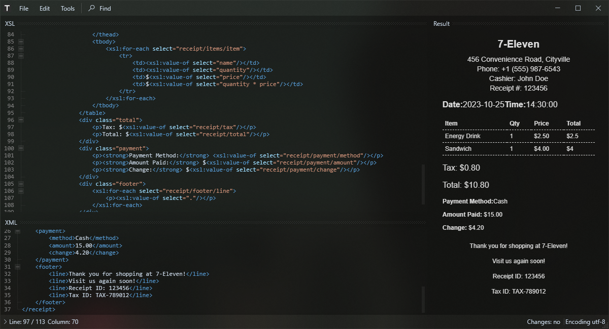

# XSLT Editor

A simple and convenient XSLT editor with real-time compilation and a Fluent Window style interface.

## Features

- **XSLT v1**: Compilation support using `XslCompiledTransform`.
- **Auto-completion**: Auto-completion support with the ability to edit sentences in `Resources/completions.json` or the corresponding window.

## Installation

1. Go to the [releases page](https://github.com/Rckov/Xslt-Editor/releases/latest) and download the latest version.
2. Extract the archive.
3. Run the application.

## Preview

## License

This project is licensed under the [MIT](LICENSE) license.
