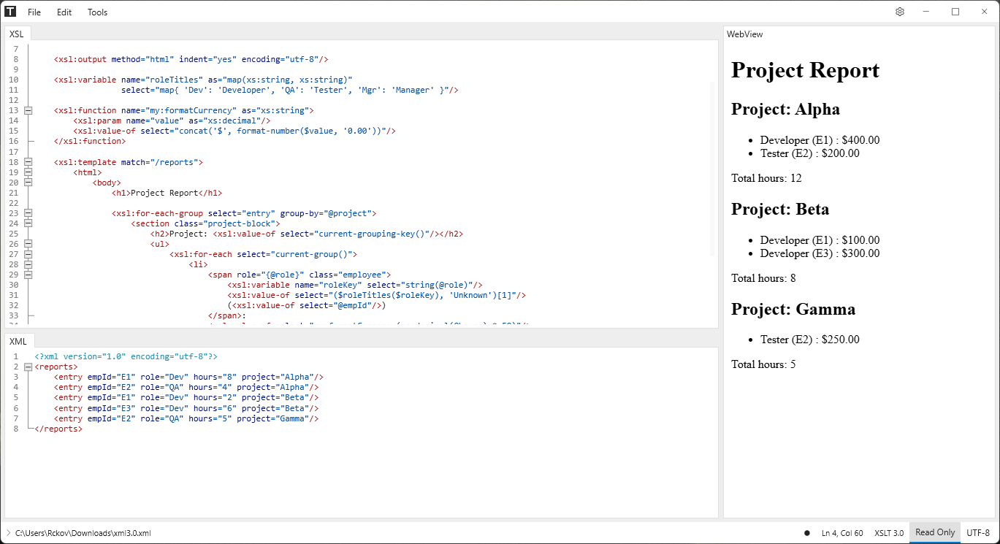
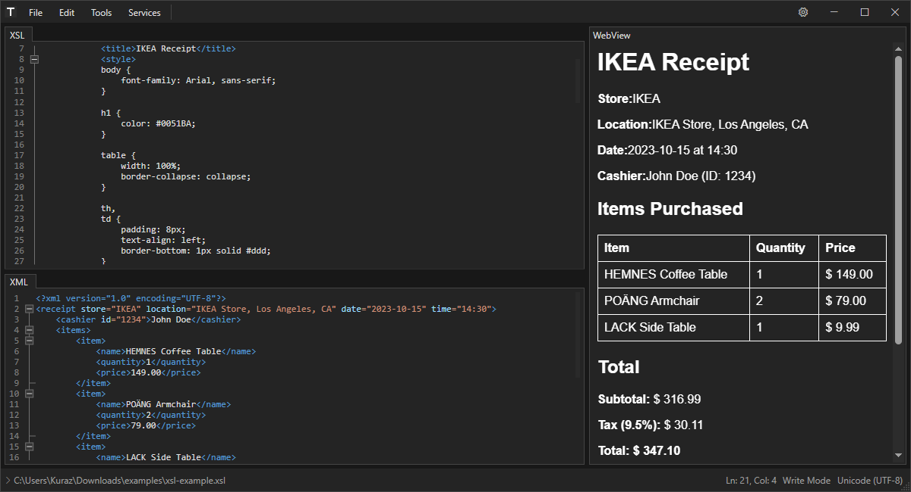

## XSLT Editor

<!---->

A lightweight XSLT editor with real-time compilation

### Features
- XSLT 1.0 / 2.0 / 3.0 ([Saxon-HE](https://github.com/Saxonica/Saxon-HE))
- Smart autocompletion
- Plugin support
- Real-time compilation
- Light & dark themes

### Preview
| Light Theme | Dark Theme |
|------------|-------------|
|  |  |

### Plugins (Ideas welcome)
- [XML Formatter](https://github.com/Rckov/Xslt-Editor-Plugins/tree/master/src/Formatter)

### Future Plans (Possibly)
- [x] Saxon-HE Integration  
- [x] Dynamic Color Adaptation
- [x] Plugins
- [ ] ...

### Installation
1. Download the latest release from [Releases](https://github.com/Rckov/Xslt-Editor/releases/latest).
2. Run `XsltEditor-Setup.msi` and follow the installation wizard.

## License
[MIT License](LICENSE) | [Report an Issue](https://github.com/Rckov/Xslt-Editor/issues)
