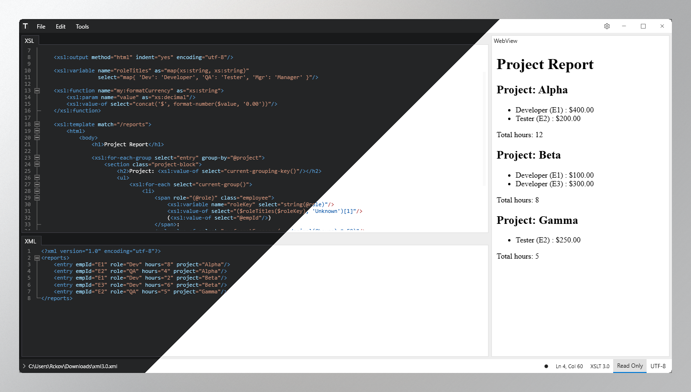

## XSLT Editor

A lightweight XSLT editor with real-time compilation

## Features

- **XSLT 1.0 / 2.0 / 3.0** - Built-in .NET engine + [Saxon-HE](https://github.com/Saxonica/Saxon-HE)
- **Real-time compilation** - See results as you type
- **Smart autocompletion** - XSLT tag suggestions
- **Plugin support** - Extend with custom functionality

## Installation

Download the latest `XsltEditor-Setup.msi` from [Releases](https://github.com/Rckov/Xslt-Editor/releases/latest) and run the installer.

>**Requirements:** Windows 10/11

## Plugins

Extend the editor with community plugins from the [plugins repository](https://github.com/Rckov/Xslt-Editor-Plugins):

- **XML Formatter** - Format documents  
- **XPath Validator** - Test XPath expressions

> Want to create your own plugin? Check out the [SDK](https://github.com/Rckov/Xslt-Editor-Sdk) with full documentation and examples. Plugins are loaded dynamically and run in isolated contexts for stability..

## Future Plans

- [x] Saxon-HE Integration - Full XSLT 2.0/3.0 support
- [x] Light & Dark themes - Adaptive UI with syntax highlighting
- [x] Plugins - Extensible architecture with SDK

## License
[MIT License](LICENSE) | [Report an Issue](https://github.com/Rckov/Xslt-Editor/issues)
